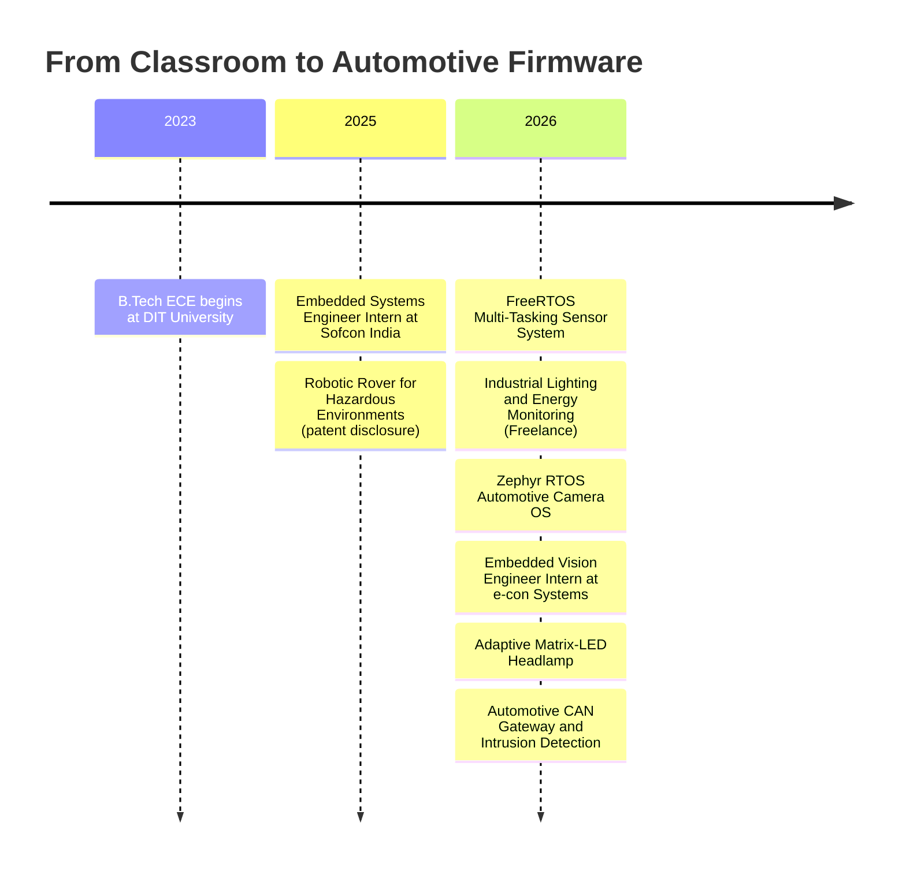
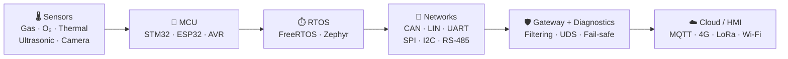
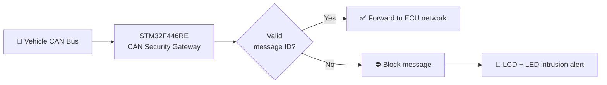

<!-- ═══════════════════════ HERO BANNER ═══════════════════════ -->
<div align="center">
  
</div>

<div align="center">
  <a href="https://github.com/choudharyprabhat735">
    
  </a>
</div>

<br/>

<div align="center">

[](https://www.linkedin.com/in/prabhat-kumar-792956357)
[](mailto:choudharyprabhat25@gmail.com)
[](https://github.com/choudharyprabhat735)


</div>

---

## 🧑‍💻 `whoami`

```bash
$ whoami
prabhat-kumar

$ cat profile.txt
role        : Embedded Systems Engineer
focus       : Automotive Firmware (CAN/LIN/UDS) · Embedded Vision · RTOS
education   : B.Tech ECE — DIT University (2023 – Present)
experience  : Sofcon India (Embedded Systems Intern) · e-con Systems (Embedded Vision Intern)
platforms   : STM32F4/F1 · ESP32 · AVR
rtos        : FreeRTOS · Zephyr RTOS
hardware    : Altium Designer · Signal Integrity · EMI/EMC · DRC/DFM
debug       : JTAG/SWD · Logic Analyzer · Oscilloscope · Vector CANoe
achievement : Institutional patent disclosure (DIT University CIIES)
status      : Open to off-campus opportunities 🚀
```

I design firmware and hardware for **automotive and industrial embedded systems**, from bare-metal drivers and RTOS task design to CAN/LIN networks, camera pipelines, and PCB bring-up. I like systems that are **real-time, fail-safe, and debuggable on the bench**.

---

## ⚡ Impact at a Glance

<div align="center">
<table>
<tr align="center">
<td><h2>🖥️ 3</h2><sub><b>MCU platforms</b><br/>STM32 · ESP32 · AVR</sub></td>
<td><h2>🔌 5</h2><sub><b>Comm. drivers</b><br/>UART · SPI · I2C · CAN · RS-485</sub></td>
<td><h2>🚀 1 Mbps</h2><sub><b>Real-time industrial</b><br/>data exchange</sub></td>
</tr>
<tr align="center">
<td><h2>⏱️ 30%</h2><sub><b>Integration time</b><br/>reduced</sub></td>
<td><h2>🎯 35%</h2><sub><b>Worst-case RTOS</b><br/>latency cut</sub></td>
<td><h2>🛠️ 10+</h2><sub><b>Hardware defects</b><br/>fixed at bring-up</sub></td>
</tr>
</table>
</div>

---

## 🗺️ Career Journey



## 🏗️ Systems I Build



---

## 🧰 Tech Arsenal

<div align="center">
  
</div>

<br/>

<div align="center">

**🧠 Languages & Firmware**  


**🔲 Microcontrollers**  


**🚗 Automotive & Communication Protocols**  


**🧩 PCB & Hardware Design**  


**🔬 Debug & Tooling**  


</div>

---

<!-- Snake Game Repo View -->

<div align="center">
  
</div>

---

## 💼 Professional Experience

<table>
<tr>
<td width="140" align="center"><h1>👁️</h1><b>Jun – Aug<br/>2026</b><br/><sub>Chennai · Onsite</sub></td>
<td>
<h3>Embedded Vision Engineer Intern · <i>e-con Systems Pvt Ltd.</i></h3>
<ul>
<li>Worked on <b>embedded camera systems</b>, configuring camera modules for real-time image/video capture.</li>
<li>Used <b>C/C++ and Linux</b> for camera integration, testing, and debugging on embedded platforms.</li>
<li>Tested camera interfaces and video pipelines, troubleshooting <b>frame capture and resolution</b> issues.</li>
</ul>
<code>C/C++</code> <code>Embedded Linux</code> <code>Camera Modules</code> <code>Video Pipelines</code>
</td>
</tr>
<tr>
<td width="140" align="center"><h1>🔧</h1><b>Jun – Aug<br/>2025</b><br/><sub>Delhi · Onsite</sub></td>
<td>
<h3>Embedded Systems Engineer Intern · <i>Sofcon India Pvt Ltd.</i></h3>
<ul>
<li>Developed and tested firmware on <b>3 platforms (STM32, ESP32, AVR)</b> and designed <b>5 communication drivers</b> (UART/SPI/I2C/CAN/RS-485) for real-time industrial data exchange up to <b>1 Mbps</b>, <b>reducing integration time by 30%</b>.</li>
<li>Accelerated bring-up by diagnosing and fixing <b>10+ hardware defects</b> using JTAG/SWD and logic analyzers.</li>
</ul>
<code>STM32</code> <code>ESP32</code> <code>AVR</code> <code>CAN</code> <code>RS-485</code> <code>JTAG/SWD</code>
</td>
</tr>
</table>

---

## 🚀 Featured Projects

### 🛡️ Flagship: Intelligent Automotive Gateway & Intrusion Detection System
   

An STM32-based **CAN security gateway** that inspects vehicle messages, **allows valid IDs, and blocks unauthorized ones**, with real-time **intrusion alerts** on LCD and LED indicators. Message filtering is implemented in Embedded C.



<br/>

<table>
<tr>
<td width="50%" valign="top">
<h3>💡 Adaptive Matrix-LED Headlamp</h3>
<code>Altium</code> <code>STM32F4</code> <code>CAN/LIN</code> <code>UDS</code> · <sub>Jul 2026</sub>
<ul>
<li>Controller that uses <b>CAN and LIN data</b> to adjust <b>24 LED segments</b> for glare-free high beam and cornering light.</li>
<li>Combines <b>UDS diagnostics</b> and <b>fail-safe logic</b> that switches to low beam within milliseconds if sensor data is lost.</li>
</ul>
</td>
<td width="50%" valign="top">
<h3>📷 Automotive Camera OS (Zephyr RTOS)</h3>
<code>Zephyr RTOS</code> <code>Camera Driver</code> <code>Embedded C</code> · <sub>Jun 2026</sub>
<ul>
<li>Camera OS for <b>front dashcam and rear/reverse</b> channels, split into capture, frame-buffering, processing, recording, and health-monitoring.</li>
<li>Full <b>capture-to-display/storage pipeline</b> with an HMI dashboard showing FPS, latency, frame drops, memory, and storage status.</li>
</ul>
</td>
</tr>
<tr>
<td width="50%" valign="top">
<h3>🌡️ Industrial Lighting & Energy Monitoring</h3>
<code>ESP32</code> <code>IoT</code> <code>MQTT</code> <code>Cloud</code> · <sub>Mar 2026 · Freelance</sub>
<ul>
<li>Sensor-driven lighting that <b>switches on/off and dims</b> automatically when daylight is present.</li>
<li><b>MQTT cloud integration</b> for zone-wise control, live status, and energy-use monitoring.</li>
</ul>
</td>
<td width="50%" valign="top">
<h3>⏱️ FreeRTOS Multi-Tasking Sensor System</h3>
<code>STM32</code> <code>FreeRTOS</code> <code>Embedded C</code> · <sub>Feb 2026</sub>
<ul>
<li>Reads <b>5 sensors concurrently</b> as separate tasks, with <b>queues</b> for conflict-free, lossless data transfer.</li>
<li>Tuned task priorities to <b>cut worst-case response delay by 35%</b>.</li>
</ul>
</td>
</tr>
<tr>
<td colspan="2" valign="top">
<h3>🤖 Robotic Rover for Hazardous Environment Surveillance & Safety Assessment &nbsp;📄 <i>Patent Disclosure</i></h3>
<code>STM32</code> <code>Multi-Sensor Fusion</code> <code>4G / LoRa / Wi-Fi</code> · <sub>Jul 2025 · Filed with DIT University CIIES</sub>
<ul>
<li>Co-developed a <b>semi-autonomous rescue robot</b> for disaster and mine environments: hardware development, sensor circuit design (Gas / O₂ / thermal / ultrasonic), and system integration.</li>
<li>Designed a <b>multi-mode 4G/LTE, LoRa and Wi-Fi</b> communication system that auto-selects the best link for reliable telemetry and video streaming in signal-degraded underground and rubble environments.</li>
</ul>
</td>
</tr>
</table>

---

## 🎓 Education & Certifications

<div align="center">


</div>

---

## 🤝 What I Bring to a Team

| | |
|:---|:---|
| 🔩 **Bring-up & Debug** | Fixed 10+ hardware defects across 3 platforms using JTAG/SWD, logic analyzers, and oscilloscopes |
| 🚗 **Automotive Networks** | CAN/LIN messaging, UDS diagnostics, fail-safe design, and security filtering at the gateway |
| ⏱️ **Real-Time Firmware** | FreeRTOS & Zephyr task design, queue-based IPC, and priority tuning for measurable latency gains |
| 📷 **Embedded Vision** | Camera module configuration, capture pipelines, and Linux-based debugging |
| 🧩 **Hardware + Firmware** | Altium schematics/PCB with SI, EMI/EMC, DRC/DFM awareness alongside firmware ownership |
| 🤝 **Collaboration** | Team leadership, cross-functional communication, and clear technical documentation |

---

## 🔭 Currently

| | |
|---|---|
| 🔨 **Building** | CAN security gateway & IDS, matrix-LED headlamp (CAN/LIN + UDS), Zephyr camera OS |
| 🌱 **Learning** | Zephyr RTOS, Embedded Linux & camera pipelines, Edge AI, automotive diagnostics (UDS) |
| 👯 **Collaborating on** | Automotive networks, IoT sensor systems, robotics, hardware prototyping |
| 🤔 **Seeking help with** | Signal integrity, EMI/EMC-aware PCB design, firmware for real-time safety-critical systems |

---

## 📊 GitHub Analytics

<div align="center">

<!-- Stats & Top Langs: github-stats-extended (maintained successor of github-readme-stats; the old vercel host is paused) -->


<!-- Streak: demolab host -->


<!-- Activity Graph: self-hosted SVG generated by GitHub Actions (see .github/workflows/activity-graph.yml). No third-party server needed. -->


</div>

<!-- Trophies disabled: github-profile-trophy.vercel.app is returning HTTP 402 right now. Remove the comment markers to re-enable once it is back.
### 🏆 GitHub Trophies

-->

### 🔝 Top Contributed Repo


### ✍️ Random Dev Quote


---

## 📫 Let's Build Something

Got an **automotive, RTOS, embedded vision, or hardware prototyping** idea? I'm open to **collaboration, projects, and full-time/off-campus opportunities**.

<div align="center">

[](mailto:choudharyprabhat25@gmail.com)
[](https://www.linkedin.com/in/prabhat-kumar-792956357)

**⚡ Code · Connect · Control: one embedded system at a time.**

[](https://visitcount.itsvg.in)


</div>

<!-- Proudly created with GPRM ( https://gprm.itsvg.in ) -->
